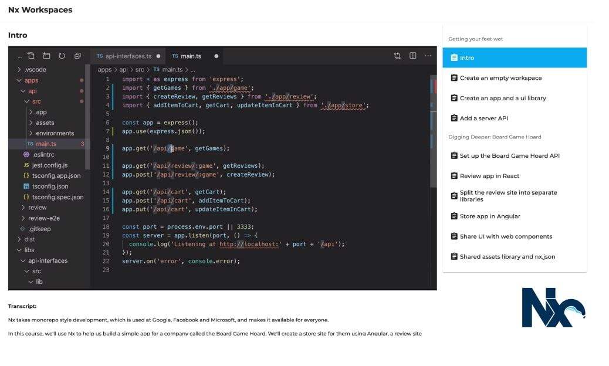

# Resources

### Learn Nx in 30 Minutes

<iframe width="560" height="380" src="https://www.youtube.com/embed/XZpp52IqD2A" frameborder="0" allow="accelerometer; autoplay; encrypted-media; gyroscope; picture-in-picture" allowfullscreen></iframe>

### Angular Enterprise Monorepo Pattens Book

[This is a free book](https://go.nrwl.io/angular-enterprise-monorepo-patterns-new-book?utm_campaign=Book%3A%20Monorepo%20Patterns%2C%20Jan%202019&utm_source=Github&utm_medium=Banner%20Ad) on using Nx in large organizations. It is very practical. Even though it covers the general benefits of Google-style development, it focuses on concrete problems and how to effectively use Nx to solve them.

### Free Course

#### Create a free account on the Connect Platform and enjoy a complete Nx course on us!

### Books and Blogs

- [Angular Enterprise Monorepo Patters Book](https://go.nrwl.io/angular-enterprise-monorepo-patterns-new-book?utm_campaign=Book%3A%20Monorepo%20Patterns%2C%20Jan%202019&utm_source=Github&utm_medium=Banner%20Ad)
- [Nx blog posts](https://blog.nrwl.io/nx/home)

### Videos

- [Video course on using Nx Workspaces](https://connect.nrwl.io/app/courses/nx-workspaces/intro)

### Talks

- [Angular at Large Organizations](https://www.youtube.com/watch?v=piQ0EZhtus0)
- [Nx: The New Way to Build Enterprise Angular Apps](https://www.youtube.com/watch?v=xo-1SDmvM8Y)
- [Supercharging the Angular CLI](https://www.youtube.com/watch?v=bMkKz8AedHc)
- [Hands on Full Stack development with Nx and Bazel](https://www.youtube.com/watch?v=1KDDIhcQORM)
- [Modern Development with Angular CLI & Nrwl Nx](https://www.youtube.com/watch?v=tE8sUAfKI3g)

### Podcasts and Shows

- [ngAir 140: Nx for Enterprise Angular Development](https://www.youtube.com/watch?v=qYNiOKDno_I)
- [ngHouston: NX Demo](https://www.youtube.com/watch?v=E_UlU2Yv4G0)

## Misc

- [nx-examples](https://github.com/nrwl/nx-examples) repo has branches for different nx comments to display expected behavior and example app and libraries. Check out the branch (workspace, ngrx...) to see what gets created for you. More info on readme.
- [xplat - Cross-platform tools for Nx workspaces](https://nstudio.io/xplat/)
