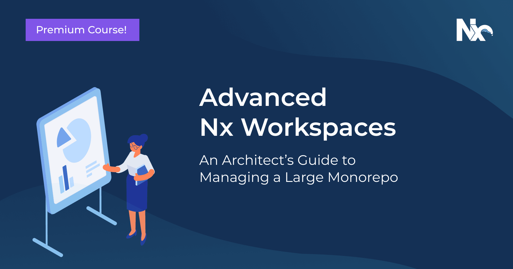

# Resources

## Quick Introductions (10 Minutes)

<iframe width="560" height="315" src="https://www.youtube.com/embed/cXOkmOy-8dk" frameborder="0" allow="accelerometer; autoplay; clipboard-write; encrypted-media; gyroscope; picture-in-picture" allowfullscreen></iframe>

## 45-Minute Walkthrough

<iframe width="560" height="315" src="https://www.youtube.com/embed/h5FIGDn5YM0" frameborder="0" allow="accelerometer; autoplay; encrypted-media; gyroscope; picture-in-picture" allowfullscreen></iframe>

## Nx Console Overview

<iframe width="560" height="315" src="https://www.youtube.com/embed/IIetmfgozgI" frameborder="0" allow="accelerometer; autoplay; encrypted-media; gyroscope; picture-in-picture" allowfullscreen></iframe>

## Courses

## Nx Workspace (free)

<iframe width="560" height="315" src="https://www.youtube.com/embed/2mYLe9Kp9VM" frameborder="0" allow="accelerometer; autoplay; encrypted-media; gyroscope; picture-in-picture" allowfullscreen></iframe>

## Advanced Nx Workspace (premium)

## Resources

### Highlights

- [Nrwl Talks, Presentations, and Podcasts playlist on YouTube](https://www.youtube.com/playlist?list=PLakNactNC1dHHWx4JIORwfnEajRv6FG5m)

- [Nx Blog Posts](https://blog.nrwl.io/nx/home)

- [nx-examples](https://github.com/nrwl/nx-examples) repo has branches for different nx comments to display expected behavior and example app and libraries. Check out the branch (workspace, ngrx...) to see what gets created for you. More info on readme.

- [Nx Office Hours playlist on YouTube](https://www.youtube.com/playlist?list=PLakNactNC1dE8KLQ5zd3fQwu_yQHjTmR5)

### Nx Demo & Tutorial Videos

- [Nx Dev Tools for Monorepos, In-Depth Explainer (React)](https://www.youtube.com/watch?v=jCf92IyR-GE)

- [Nx Dev Tools for Monorepos, In-Depth Explainer (Angular)](https://youtu.be/h5FIGDn5YM0)

- [Storybook Integration with Nx](https://youtu.be/sFpqyjT7u4s)

- [Building Custom Plugins for Nx](https://youtu.be/XYO689PAhow)

- [Improved Dependency Graph Visualization for Nx](https://youtu.be/cMZ-ReC-jWU)

- [Group all your stories into a single viewable Storybook with Nx](https://youtu.be/c323HOuFKkA)

- [Debug Nx with Node and VSCode](https://youtu.be/OGV4R0cPRPc)

- [Debug your Jest tests in Nx with VSCode](https://youtu.be/9_lgM2nokLg)

- [Nx Console - A Must-Have Visual Studio Code Extension for Angular Developers](https://youtu.be/IIetmfgozgI)

- [Introducing Nx Cloud](https://youtu.be/pwG20nNTEQc)

- [Setting up distributed caching using Nx Cloud, @nrwl/nx-cloud](https://youtu.be/w1-GiB74ddc)

- [High Quality React apps with Nx & Cypress](https://youtu.be/mfJBLhjYMdo)

### Books and Blogs

- [Angular Enterprise Monorepo Patterns Book (free)](https://go.nrwl.io/angular-enterprise-monorepo-patterns-new-book?utm_campaign=Book%3A%20Monorepo%20Patterns%2C%20Jan%202019&utm_source=Github&utm_medium=Banner%20Ad)

- [High Quality React apps with Nx & Cypress](https://cypress.io/blog/2020/04/14/high-quality-react-apps-with-nx-cypress/) (April 2020)

- [Shell Library patterns with Nx and Monorepo Architectures](https://indepth.dev/the-shell-library-patterns-with-nx-and-monorepo-architectures/) (March 2020)

- [Tiny Angular application projects in Nx workspaces](https://indepth.dev/tiny-angular-application-projects-in-nx-workspaces/#peer-reviewers--30/) (March 2020)

### Additional Resources

- [xplat - Cross-platform tools for Nx workspaces](https://nstudio.io/xplat/)
