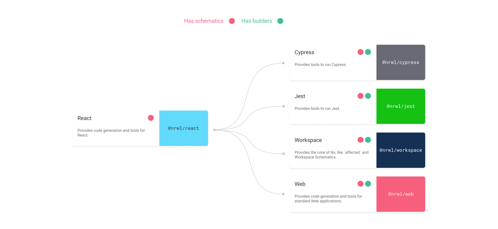

# API

Here is the list of all the available packages inside the Nx ecosystem. You
can see, for each package its dependencies.

| PackageName     | Dependencies                         | PeerDependencies |
| --------------- | ------------------------------------ | ---------------- |
| @nrwl/angular   | @nrwl/cypress, @nrwl/jest            | @nrwl/workspace  |
| @nrwl/cypress   |                                      | @nrwl/workspace  |
| @nrwl/express   | @nrwl/node, @nrwl/jest               | @nrwl/workspace  |
| @nrwl/jest      |                                      | @nrwl/workspace  |
| @nrwl/nest      | @nrwl/node, @nrwl/jest               | @nrwl/workspace  |
| @nrwl/node      | @nrwl/jest                           | @nrwl/workspace  |
| @nrwl/react     | @nrwl/cypress, @nrwl/jest, @nrwl/web | @nrwl/workspace  |
| @nrwl/web       | @nrwl/cypress, @nrwl/jest            | @nrwl/workspace  |
| @nrwl/workspace |                                      |                  |

## Angular

## React

## Nest

## Express

## Node

## Cypress

## Jest

## Web

