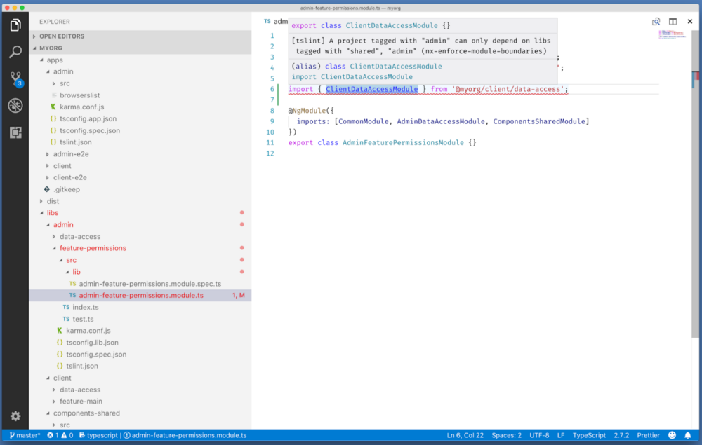

# Developing Like Google: Monorepos and Automation

In this guide you will look at one of the most interesting parts of Nx. The part that make so many things so much easier, that it has a transformative effect on a team and even on an organization.

What is it?

It is a "monorepo" way of building applications.

Working with multiple applications and libraries is difficult. From Google to Facebook, Uber, Twitter and more, a good amount of large software companies handle this challenge by taking a monorepo approach. And they have been doing so for years. These are some of the advantages this approach provides:

- Everything at that current commit works together. Changes can be verified across all affected parts of the organization.
- Easy to split code into composable modules
- Easier dependency management
- One toolchain setup
- Code editors and IDEs are "workspace" aware
- Consistent developer experience

To see how Nx delivers all of these, start with an empty Nx workspace:

## Monorepos with Nx

```treeview
<workspace name>/
├── apps/
├── libs/
├── nx.json
├── package.json
├── tools/
├── tsconfig.json
└── tslint.json
```

An empty workspace has several root-level configuration files and the folders for applications, libraries, and tools. Since an Nx workspace is an Angular CLI workspace, most configuration files are created by Angular CLI. The only exception is `nx.json`, which contains Nx-specific configuration.

## Applications and Libraries

Nx supports two types of **projects**: applications and libraries.

- An **application** is anything that can run in the browser or on the server. It's similar to a binary.
- A **library** is a piece of code with a well-defined public API. A library can be imported into another library or application. You cannot run a library.

### Applications

Out of the box, Nx comes with two schematics for creating applications.

- `ng g application myapp` will create an Angular application.
- `ng g node-application myapp` will create a Node.js application using Nest.

Creating a new Angular application will result in something like this:

```treeview
<workspace name>/
├── README.md
├── angular.json
├── apps/
│   ├── myapp/
│   │   ├── browserslist
│   │   ├── jest.conf.js
│   │   ├── src/
│   │   │   ├── app/
│   │   │   ├── assets/
│   │   │   ├── environments/
│   │   │   ├── favicon.ico
│   │   │   ├── index.html
│   │   │   ├── main.ts
│   │   │   ├── polyfills.ts
│   │   │   ├── styles.scss
│   │   │   └── test.ts
│   │   ├── tsconfig.app.json
│   │   ├── tsconfig.json
│   │   ├── tsconfig.spec.json
│   │   └── tslint.json
│   └── myapp-e2e/
├── libs/
├── nx.json
├── package.json
├── tools/
├── tsconfig.json
└── tslint.json
```

You can run:

- `ng serve myapp` to serve the application
- `ng build myapp` to build the application
- `ng test myapp` to test the application
- `ng lint myapp` to lint the application

Using an Nx workspace with a single Angular application is almost identical to using a standard CLI project.

### Libraries

Nx comes with a schematic for creating libraries.

- `ng g library mylibrary` will create an Angular library.
- `ng g library mylibrary --framework=none` will create a TypeScript library.

Creating a new TypeScript library will result in something like this:

```treeview
<workspace name>/
├── apps/
├── libs/
│   └── mylibrary/
│       ├── jest.conf.js
│       ├── src/
│       │   ├── lib/
│       │   └── index.ts
│       ├── tsconfig.app.json
│       ├── tsconfig.json
│       ├── tsconfig.spec.json
│       └── tslint.json
├── nx.json
├── package-lock.json
├── package.json
├── tools/
├── tsconfig.json
└── tslint.json
```

By default, libraries are only buildable in the context of a particular application. As a result, the only two available targets are:

- `ng test mylib` to test the library
- `ng lint mylib` to lint the library

To be able to build a library independently, you can pass `--publishable` when creating it. You can then run `ng build mylib` to build it, and then publish the results to an NPM registry.

You can import library like this:

```typescript
import { SomeToken } from '@myorg/mylib'; // the `@myorg` scope is configured in `nx.json`.
```

### Sharing Code

Without Nx creating a new shared library can take weeks: a new repo needs to be provisioned, CI needs to be set up, etc.. In an Nx Workspace it takes minutes:

<iframe width="560" height="315" src="https://www.youtube.com/embed/jMql4zzDxZM" frameborder="0" allow="accelerometer; autoplay; encrypted-media; gyroscope; picture-in-picture" allowfullscreen></iframe>

It's hard to overstress how powerful this is. If it takes days or weeks to create a new reusable library, few will do it. As a result, developers will either duplicate the code or put it in a place where it does not belong. When it is easy to scaffold and configure a reusable library within minutes (instead of days), only then will developers invest in building and maintaining reusable libraries.

### Understanding Your Nx Workspace

An Nx workspace can contain dozens (or hundreds) of applications and libraries. It can be difficult to understand how they depend upon each other, and what are the implications of making a particular change.

Previously, some senior architect would create an ad-hoc dependency diagram and upload it to a corporate wiki. The diagram isn’t correct even on Day 1, and gets more and more out of sync with every passing day.

With Nx, you can do better than that. You can run `yarn dep-graph` to see a current dependency diagram of the workspace: what apps and libs are there, how they depend on each other, what is loaded lazily and what is not. Nx uses code analysis to collect this information.


It can also help you answer questions like "what apps will have to be redeployed if I change this file?"


Because Nx understands how our applications and libraries depend on each other, it can verify that a code change to a reusable library does not break any applications and libraries depending on it.

```bash
yarn affected:apps --base=master # prints the apps affected by a PR

yarn affected:build --base=master # reruns build for all the projects affected by a PR

yarn affected:test --base=master # reruns unit tests for all the projects affected by a PR

yarn affected:e2e --base=master # reruns e2e tests for all the projects affected by a PR

yarn affected --target=lint --base=master # reruns any target (for instance lint) for projects affected by a PR
```

Nx will topologically sort the projects, and will run what it can in parallel. The fact that Nx can use its dependency graph to rebuild and retest the minimal number of projects necessary is crucial. Without this the repo won't scale beyond a handful of projects.

Read more about how to use `affected:*` commands [here](/guides/monorepo-affected).

### Imposing Constraints on the Dependency Graph

If you partition your code into well-defined cohesive units, even a small organization will end up with a dozen applications and dozens or hundreds of libraries. If all of them can depend on each other freely, chaos will ensue and the workspace will become unmanageable.

To help with that Nx uses code analyses to make sure projects can only depend on each other’s well-defined public API. It also allows us to declaratively impose constraints on how projects can depend on each other.

For instance, with this configuration, when you import private client code from the admin part of our repo, you will get an error.

```json
"nx-enforce-module-boundaries": [
  true,
  {
    "allow": [],
    "depConstraints": [
       {
          "sourceTag": "shared",
          "onlyDependOnLibsWithTags": ["shared"]
       },
       {
          "sourceTag": "admin",
          "onlyDependOnLibsWithTags": ["shared", "admin" ]
       },
       {
          "sourceTag": "client",
          "onlyDependOnLibsWithTags": ["shared", "client" ]
       },
       {
          "sourceTag": "*",
          "onlyDependOnLibsWithTags": ["*"]
       }
     ]
  }
]
```



Read more about this feature [here](/guides/monorepo-tags).

## Tools and Automation

In addition to implementing monorepo-style of development, Nx brings in another key element of Google dev culture--emphasis on tooling.

### Workspace Schematics

Schematics is what what powers all Angular CLI (and Nx) code generation. With Nx, you can easily define workspace-specific schematics that you can then use to enforce best practices. Read more about it [here](/guides/tools-workspace-schematics).

### Code Formatting

Pointing out code formatting issue isn't the best way to spend the time allocated for code reviews. We know that, and that's why Nx comes with Prettier support. Run:

```bash
yarn format:write # formats the files

yarn format:check # checks that the formatting is correct (used in CI)
```

Read more about it [here](/guides/modernize-prettier).

## Understanding Nx.json

You rarely have to look at `nx.json`, but it is still important to understand what it contains.

```json
{
  "npmScope": "myorg",
  "implicitDependencies": {
    "angular.json": "*",
    "package.json": "*",
    "tsconfig.json": "*",
    "tslint.json": "*",
    "nx.json": "*"
  },
  "projects": {
    "mylib": {
      "tags": [],
      "implicitDependencies": []
    },
    "myapp": {
      "tags": ["shared"],
      "implicitDependencies": []
    },
    "myapp-e2e": {
      "tags": [],
      "implicitDependencies": ["myapp"]
    }
  }
}
```

The `npmScope` property is used when importing libraries. In this example, when Nx sees `@myorg/mylib`, it will know that you are trying to import the `mylib` library from the same workspace.

The `implicitDependencies` map is used to define what projects are affected by global files. In this example, any change to `package.json` will affect all the projects in the workspace, so all of them will have to be rebuilt and retested.

```json
{
  "implicitDependencies": {
    "angular.json": "*",
    "package.json": ["mylib"],
    "tsconfig.json": "*",
    "tslint.json": "*",
    "nx.json": "*"
  }
}
```

In this example, any change to `package.json` will only affect `mylib`.

```json
{
  "myapp": {
    "tags": ["shared"],
    "implicitDependencies": []
  },
  "myapp-e2e": {
    "tags": [],
    "implicitDependencies": ["myapp"]
  }
}
```

The `tags` array is used to impose constraints on the dependency graph. Read more about it [here](/guides/monorepo-tags).

Nx uses its advanced code analysis to construct a dependency graph of all applications and libraries. Some dependencies, however, cannot be determined statically. You can use the `implicitDependencies` array to list the dependencies that cannot be determined statically.

## Summary

With Nx, you can use effective development practices pioneered at Google:

- Monorepo-style development. You can build multiple Angular and Node.js applications out of reusable libraries.
- Automation. You can enforce best practices uses workspace-specific schematics and code formatters.
