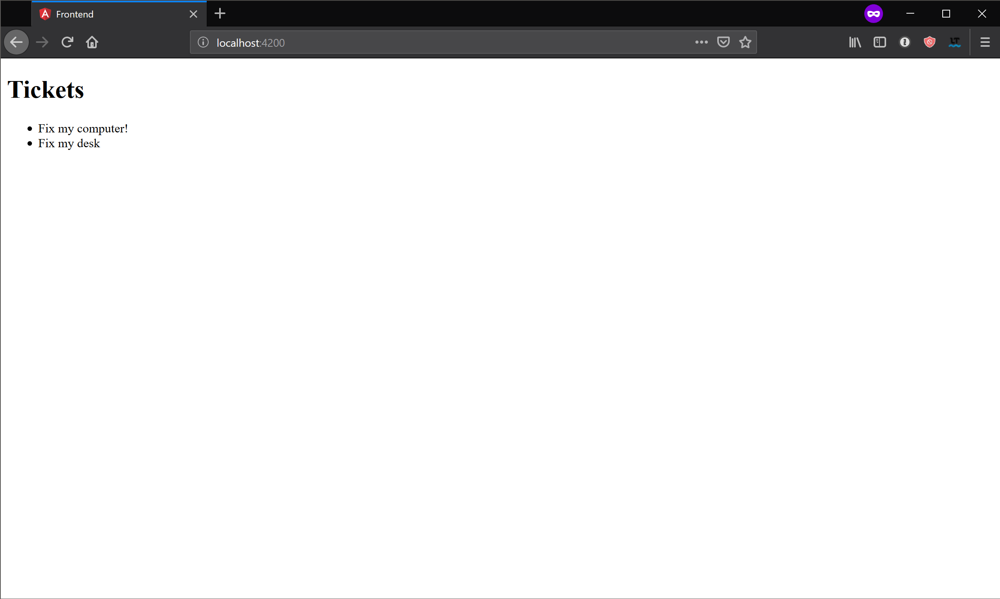

# Building Full-Stack Applications using Angular and Nest

In this guide you will build a full-stack application using Angular and Nest.

## Creating Angular Application

Start with implementing the frontend.

The easier way to add a frontend app to an Nx workspace is to run `ng g application frontend`, which will create:

```treeview
<workspace name>/
├── README.md
├── angular.json
├── apps/
│   ├── frontend/
│   │   ├── browserslist
│   │   ├── jest.conf.js
│   │   ├── src/
│   │   │   ├── app/
│   │   │   ├── assets/
│   │   │   ├── environments/
│   │   │   ├── favicon.ico
│   │   │   ├── index.html
│   │   │   ├── main.ts
│   │   │   ├── polyfills.ts
│   │   │   ├── styles.scss
│   │   │   └── test.ts
│   │   ├── tsconfig.app.json
│   │   ├── tsconfig.json
│   │   ├── tsconfig.spec.json
│   │   └── tslint.json
│   └── frontend-e2e/
├── libs/
├── nx.json
├── package.json
├── tools/
├── tsconfig.json
└── tslint.json
```

If you have used the Angular CLI, this should all look familiar: same configuration files, same folders.

You can run:

- `ng serve frontend` to serve the application
- `ng build frontend` to build the application
- `ng test frontend` to test the application

## Creating Node Application

Real-world applications don’t live in isolation — they need APIs to talk to.

```typescript
interface Ticket {
  id: number;
  title: string;
}

@Component({
  selector: 'tuskorg-root',
  template: `
    <h1>Tickets</h1>
    <ul>
      <li *ngFor="let t of (tickets | async)">{{ t.title }}</li>
    </ul>
  `
})
export class AppComponent {
  tickets: Observable<Ticket[]>;

  constructor(http: HttpClient) {
    this.tickets = http.get<Ticket[]>('/api/tickets');
  }
}
```

Next, create the api. You can do it by running `ng g node-application api --frontend-project=frontend` (`--frontend-project=frontend` set ups the proxy configuration such that the frontend application can access the api).

```treeview
<workspace name>/
├── apps/
│   ├── frontend/
│   ├── frontend-e2e/
│   └── api/
│       ├── jest.conf.js
│       ├── proxy.conf.json
│       ├── src/
│       │   ├── app/
│       │   │   ├── app.controller.ts
│       │   │   ├── app.controller.spec.ts
│       │   │   ├── app.module.ts
│       │   │   ├── app.service.ts
│       │   │   └── app.service.spec.ts
│       │   ├── assets/
│       │   ├── environments/
│       │   │   ├── environment.ts
│       │   │   └── environment.prod.ts
│       │   └── main.ts
│       ├── tsconfig.app.json
│       ├── tsconfig.json
│       ├── tsconfig.spec.json
│       └── tslint.json
├── libs/
├── nx.json
├── package.json
├── tools/
├── tsconfig.json
└── tslint.json
```

The `apps` directory is where Nx places anything you can run: frontend applications, backend applications, e2e test suites. That's why the `api` application appeared there.

You can run:

- `ng serve api` to serve the application
- `ng build api` to build the application
- `ng test api` to test the application

By default, Nx will use Nest when generating node applications. Nest ia fantastic framework that shares many of its core concepts with Angular. It uses modules, providers, dependency injection, etc.. As a result, most Angular developers find Nest easy to use.

The generated `apps/api/src/app/app.module.ts` will look like this:

```typescript
import { Module } from '@nestjs/common';

import { AppController } from './app.controller';
import { AppService } from './app.service';

@Module({
  imports: [],
  controllers: [AppController],
  providers: [AppService]
})
export class AppModule {}
```

> If you prefer `express` or any other node framework, run the following commands instead: `ng g node-application api --framework=express` or `ng g node-application api --framework=none`.

### Implementing Endpoint

To implement your endpoint, update `app.service.ts`

```typescript
import { Injectable } from '@nestjs/common';

export interface Ticket {
  id: number;
  title: string;
}

@Injectable()
export class AppService {
  getTodos(): Ticket[] {
    return [
      { id: 1, title: 'Fix my computer!' },
      { id: 2, title: 'Fix my desk' }
    ];
  }
}
```

and `app.controller.ts`

```typescript
import { Controller, Get } from '@nestjs/common';
import { AppService, Ticket } from './app.service';

@Controller('api')
export class AppController {
  constructor(private readonly appService: AppService) {}

  @Get('tickets')
  getTodos(): Ticket[] {
    return this.appService.getTodos();
  }
}
```

Now, run `ng serve frontend & ng serve api`, and open `http://localhost:4200`.



The application works, but you have a small problem. `Ticket` is defined twice: once on the frontend, once on the backend. This duplication will inevitably result in the two interfaces going out of sync, which means that runtime errors will creep in. It's better to share this interface.

Normally sharing code between the backend and the frontend would have required days of work, but with Nx, it’s done in just minutes.

## Sharing Libs Between Frontend and Backend

Create a new lib by running `ng g library data --framework=none`.

```treeview
<workspace name>/
├── apps/
│   ├── frontend/
│   ├── frontend-e2e/
│   └── api/
├── libs/
│   └── data/
│       ├── jest.conf.js
│       ├── src/
│       │   ├── lib/
│       │   └── index.ts
│       ├── tsconfig.app.json
│       ├── tsconfig.json
│       ├── tsconfig.spec.json
│       └── tslint.json
├── nx.json
├── package.json
├── tools/
├── tsconfig.json
└── tslint.json
```

Next, move `Ticket` into `libs/data/src/index.ts`:

```typescript
export interface Ticket {
  id: number;
  title: string;
}
```

Finally, update the frontend and the backend to import the interface from the library.

```typescript
import { Observable } from 'rxjs';
import { Component } from '@angular/core';
import { HttpClient } from '@angular/common/http';
import { Ticket } from '@tuskorg/data';

@Component({
  selector: 'tuskorg-root',
  template: `
    <h1>Ticket</h1>
    <ul>
      <li *ngFor="let t of (tickets | async)">{{ t.title }}</li>
    </ul>
  `
})
export class AppComponent {
  tickets: Observable<Ticket[]>;

  constructor(http: HttpClient) {
    this.tickets = http.get<Ticket[]>('/api/tickets');
  }
}
```

```typescript
import { Injectable } from '@nestjs/common';
import { Ticket } from '@tuskorg/data';

@Injectable()
export class AppService {
  getTodos(): Ticket[] {
    return [
      { id: 1, title: 'Fix my computer!' },
      { id: 2, title: 'Fix my desk' }
    ];
  }
}
```

After this refactoring, the backend and the frontend will not get out of sync. Being able to factor code into a lot of small libraries with well-defined public API, which you can then use across both the backend and the frontend, is one of key features of Nx. You can read more about it [here](./build-like-google).

## Nx is Smart

You have already showed something amazing. You have a repository where you can build multiple Angular and Node applications and share code between them. And it took you just a few minutes.

But Nx can do a lot more than that. In Nx, your libraries, node applications, Angular applications are all part of the same dependency graph, which you can see by running `npm run dep-graph`.


If you change the data library, Nx will know that both the backend and the frontend can be affected by the change. This is what makes Nx a powerful full-stack development environment that scales. You can read more about this Nx capability in [Building Like Google](./build-like-google).

## Summary

With Nx, you can:

- Build full stack applications
- Share code between backend and frontend
- Inspect how backend and frontend depend on each other and use this information to only retest or rebuilt what is affected.
