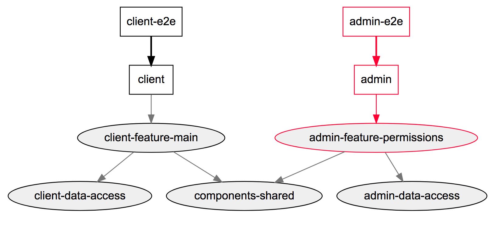

# Rebuilding and Retesting What is Affected

As with a regular CLI project, when using Nx you can build and test individual apps and libs.

```bash
ng g app client
ng g app admin
ng g lib client-feature-main
ng g lib admin-feature-permissions
ng g lib components-shared

ng build client
ng build client-feature-main # works if the lib is marked as publishable

ng test client
ng test admin
ng test client-feature-main
ng e2e client-e2e
```

Now imagine, `admin` depends on `admin-feature-permissions`. If we make a change to `admin-feature-permissions`, we need to make sure nothing in the workspace is broken unintentionally.

Typically, you would do it like this:

```bash
ng test admin-feature-permissions
ng build admin
ng test admin
ng e2e admin-e2e
```

In many organizations, you would have dozens or hundreds of apps and libs. To be productive in a monorepo, you need to be able to check that your change is safe, and rebuilding and retesting everything on every change won't scale, tracing the dependencies manually (as shown above) won't scale either.

Nx uses code analysis to construct a dependency graph of all projects in the workspace. It then uses the dependency graph to determine what needs to be rebuilt and retested.

## Viewing Dep Graph

Run `npm run dep-graph` or `yarn dep-graph` to see the dependency graph.


## Affected

To calculate the project affected by your change, Nx needs to know what file you changed. The most direct way to do it is by passing `--files`:

```bash
npm run affected:dep-graph -- --files=libs/admin-feature-permissions/src/index.ts
```



In practice it's easier to use git to determine what files have changed.

```bash
npm run affected:dep-graph -- --base=master --head=HEAD
```

The `--base` defaults to `master` and `--head` defaults to `HEAD`, so when running it locally you can usually omit it:

```bash
npm run affected:dep-graph
```

Nx will find the most common ancestor of the base and head SHAs and will use it to determine what has changed between it and head.

## Building/Testing/Printing Affected Projects

```bash
npm run affected:apps # prints affected apps
npm run affected:libs # prints affected libs
npm run affected:build # builds affected apps and libs
npm run affected:lint # lints affected apps and libs
npm run affected:test # tests affected apps and libs
npm run affected:e2e # e2e tests affected apps
```

All of these are just shortcuts for the following:

```bash
npm run affected -- --target=ANYTARGET # run ANYTARGET for all affected apps and libs
```

Options which should be forwarded to the underlying target should be delimited by a `--` (e.g., `yarn affected:test -- -- --sm=false`).

## CI

The SHAs you pass must be defined in the git repository. The `master` and `HEAD` SHAs are what you normally use while developing. Most likely you will want to provision other SHAs in your CI environment.

```bash
npm run affected:build -- --base=origin/master --head=$PR_BRANCH_NAME # where PR_BRANCH_NAME is defined by your CI system
npm run affected:build -- --base=origin/master~1 --head=origin/master # rerun what is affected by the last commit in master
```

## Running Targets in Parallel

Running targets in parallel can significantly speed up your CI time. This is particularly useful in CI.

```bash
npm run affected:build -- --parallel
npm run affected:build -- --parallel --maxParallel=5
```

## Rerunning All Targets

You should never do it in CI, but it is sometimes useful to rerun all targets locally.

```bash
npm run affected:build -- --all
```

## Running Failed

After you run any affected command, Nx remembers which targets fail. So if you want to rerun only the failed once, pass: `--only-failed`;

```bash
npm run affected:build -- --only-failed
```

## Excluding Projects

Finally, you can exclude projects like this:

```bash
npm run affected:test -- --all --exlude=admin # retests everything except admin
```

## When Nx can't Understand Your Repository

Nx uses its advanced code analysis to construct a dependency graph of all applications and libraries. Some dependencies, however, cannot be determined statically. But you can define them yourself in `nx.json`.

```json
{
  "npmScope": "myorg",
  "implicitDependencies": {
    "angular.json": "*",
    "package.json": "*",
    "tsconfig.json": "*",
    "tslint.json": "*",
    "nx.json": "*"
  },
  "projects": {
    "client": {
      "tags": [],
      "implicitDependencies": []
    },
    "client-e2e": {
      "tags": [],
      "implicitDependencies": ["client"]
    },
    "admin": {
      "tags": [],
      "implicitDependencies": []
    },
    "admin-e2e": {
      "tags": [],
      "implicitDependencies": ["admin"]
    },
    "client-feature-main": {
      "tags": [],
      "implicitDependencies": []
    },
    "admin-feature-permissions": {
      "tags": [],
      "implicitDependencies": []
    },
    "components-shared": {
      "tags": [],
      "implicitDependencies": []
    }
  }
}
```

The `implicitDependencies` map is used to define what projects are affected by global files. In this example, any change to `package.json` will affect all the projects in the workspace, so all of them will have to be rebuilt and retested. You can replace `*` with an explicit list of projects.

```json
{
  "implicitDependencies": {
    "angular.json": "*",
    "package.json": ["admin", "client"],
    "tsconfig.json": "*",
    "tslint.json": "*",
    "nx.json": "*"
  }
}
```

You can also specify dependencies between projects. For instance, if `admin-e2e` tests both the `admin` and `client` applications, you can express this as follows:

```json
{
  "admin-e2e": {
    "tags": [],
    "implicitDependencies": ["client", "admin"]
  }
}
```
