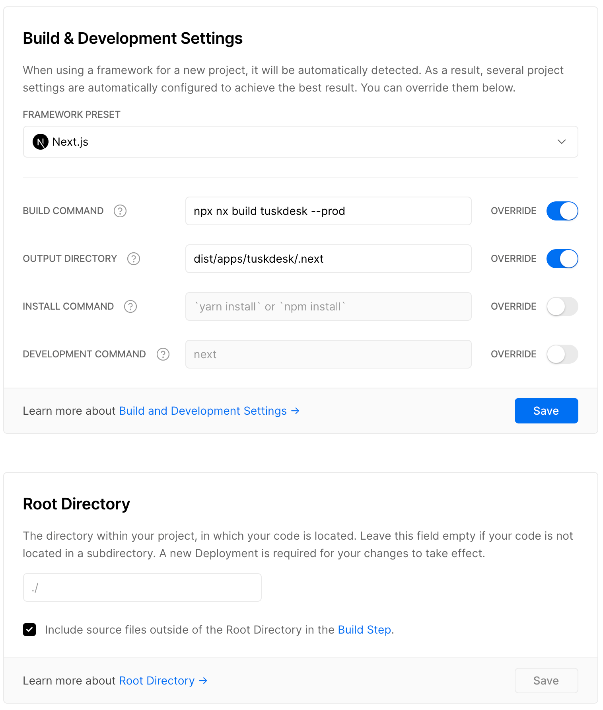

# Next.js with Nx


Nx provides a holistic dev experience powered by an advanced CLI and editor plugins. It provides rich support for common tools like [Cypress](/{{version}}/{{framework}}/cypress/overview), [Storybook](/{{version}}/{{framework}}/storybook/overview), Jest, and more.

In this guide we will show you how to develop [Next.js](https://nextjs.org/) applications with Nx.

## Creating Nx Workspace

The easiest way to create your workspace is via `npx`.

```bash
npx create-nx-workspace happynrwl \
--preset=next \
--style=css \
--appName=tuskdesk
```

**Note:** You can also run the command without arguments to go through the interactive prompts.

```bash
npx create-nx-workspace happynrwl
```

Once the command completes, the workspace will look as follows:

```treeview
happynrwl/
├── apps
│   ├── tuskdesk
│   │   ├── index.d.ts
│   │   ├── jest.config.js
│   │   ├── next-env.d.ts
│   │   ├── next.config.js
│   │   ├── pages
│   │   │   ├── _app.tsx
│   │   │   ├── index.module.css
│   │   │   ├── index.tsx
│   │   │   └── styles.css
│   │   ├── public
│   │   │   ├── nx-logo-white.svg
│   │   │   └── star.svg
│   │   ├── specs
│   │   │   └── index.spec.tsx
│   │   ├── tsconfig.json
│   │   └── tsconfig.spec.json
│   └── tuskdesk-e2e
│       ├── cypress.json
│       ├── src
│       │   ├── fixtures
│       │   ├── integration
│       │   ├── plugins
│       │   └── support
│       ├── tsconfig.e2e.json
│       └── tsconfig.json
├── babel.config.json
├── jest.config.js
├── jest.preset.js
├── libs
├── nx.json
├── package-lock.json
├── package.json
├── tools
│   ├── generators
│   └── tsconfig.tools.json
├── tsconfig.base.json
└── workspace.json
```

Run `npx nx serve tuskdesk` to start the dev server at http://localhost:4200. Try out other commands as well.

- `nx lint tuskdesk` to lint the application
- `nx test tuskdesk` to test the application using Jest
- `nx e2e tuskdesk-e2e` to test the application using Cypress
- `nx build tuskdesk` to build the application
- `nx serve tuskdesk --prod` to serve the application in the production mode

When using Next.js in Nx, you get the out-of-the-box support for TypeScript, Cypress, and Jest. No need to configure anything: watch mode, source maps, and typings just work.

### Adding Next.js to an Existing Workspace

For existing Nx workspaces, install the `@nrwl/next` package to add Next.js capabilities to it.

```bash
npm install @nrwl/next

# Or with yarn
yarn add @nrwl/next
```

## Generating an Application

To create additional Next.js apps run:

```bash
npx nx g @nrwl/next:app
```

## Generating a Library

Nx allows you to create libraries with just one command. Some reasons you might want to create a library include:

- Share code between applications
- Publish a package to be used outside the monorepo
- Better visualize the architecture using `npx nx dep-graph`

For more information on Nx libraries, see our documentation on [Creating Libraries](/{{version}}/{{framework}}/structure/creating-libraries)
and [Library Types](/{{version}}/{{framework}}/structure/library-types).

To generate a new library run:

```bash
npx nx g @nrwl/react:lib shared-ui-components
```

And you will see the following:

```treeview
happynrwl/
├── apps
│   └── tuskdesk
│   └── tuskdesk-e2e
├── babel.config.json
├── jest.config.js
├── jest.preset.js
├── libs
│   └── shared-ui-layout
│       ├── README.md
│       ├── jest.config.js
│       ├── src
│       │   ├── index.ts
│       │   └── lib
│       ├── tsconfig.json
│       ├── tsconfig.lib.json
│       └── tsconfig.spec.json
├── nx.json
├── package-lock.json
├── package.json
├── tools
├── tsconfig.base.json
└── workspace.json
```

Run:

- `npx nx test shared-ui-layout` to test the library
- `npx nx lint shared-ui-layout` to lint the library

### Using Nx Library in your Application

You can import the `shared-ui-layout` library in your application as follows.

```typescript jsx
// apps/tuskapp/pages/index.tsx
import { SharedUiLayout } from '@happynrwl/shared-ui-layout';

export function Index() {
  return (
    <SharedUiLayout>
      <p>The main content</p>
    </SharedUiLayout>
  );
}

export default Index;
```

That's it! There is no need to build the library prior to using it. When you update your library, the Next.js application will automatically pick up the changes.

### Publishable libraries

For libraries intended to be built and published to a registry (e.g. npm) you can use the `--publishable` and `--importPath` options.

```bash
npx nx g @nrwl/react:lib shared-ui-components --publishable --importPath=@happynrwl/ui-components
```

Run `npx nx build shared-ui-layout` to build the library. It will generate the following:

```treeview
dist/libs/shared-ui-layout/
├── README.md
├── index.d.ts
├── lib
│   └── shared-ui-layout.d.ts
├── package.json
├── shared-ui-layout.esm.css
├── shared-ui-layout.esm.js
├── shared-ui-layout.umd.css
└── shared-ui-layout.umd.js
```

This dist folder is ready to be published to a registry.

## Generating Pages and Components

Nx also provides commands to quickly generate new pages and components for your application.

- `npx nx g @nrwl/next:page about` to add an about page
- `npx nx g @nrwl/next:component banner` to add a banner component

Running the above commands will result in:

```treeview
apps/tuskdesk/
├── components
│   └── banner
│       ├── banner.module.css
│       ├── banner.spec.tsx
│       └── banner.tsx
├── index.d.ts
├── jest.config.js
├── next-env.d.ts
├── next.config.js
├── pages
│   ├── _app.tsx
│   ├── about.module.css
│   ├── about.tsx
│   ├── index.module.css
│   ├── index.tsx
│   └── styles.css
├── public
├── specs
├── tsconfig.json
└── tsconfig.spec.json
```

Nx generates components with tests by default. For pages, you can pass the `--withTests` option to generate tests under the `specs` folder.

Run the tests again for the application: `npx nx test tuskdesk`.

## Code Sharing

Without Nx, creating a new shared library can take from several hours or even weeks: a new repo needs to be provisioned, CI needs to be set up, etc.. In an Nx Workspace, it only takes minutes.

You can share React components between multiple Next.js applications. You can also share web components between Next.js and plain React applications. You can even share code between the backend and the frontend. All can be done without any unnecessary ceremony.

## Deploying to Vercel

You may know that the company behind Next.js, [Vercel](https://vercel.com), has a great hosting platform offering that is developed in tandem with Next.js itself to offer a great overall developer and user experience.

Starting from Nx 11, your Next.js application should already be ready for deployment to Vercel.

### Configure your Vercel project's settings appropriately

#### New Vercel project

1. If you are "importing" your Nx workspace's repository for the first time, make sure you do _not_ choose a root directory as part of the repo selection process (therefore leaving it to be the root of the full repo/workspace)
2. Ensure the Next.js "Framework Preset" is selected
3. Expand the "Build and Output Settings" and toggle the override switch for the build command. For our `tuskdesk` project the value will look like this:

```bash
npx nx build tuskdesk --prod
```

4. Toggle the override switch for the output directory. Point it to the `.next` directory inside the built app:

```bash
dist/apps/tuskdesk/.next
```

Therefore, our full configuration (based on a repo called "nx-workspace" and a project called "tuskdesk") will look like this:


#### Existing Vercel project

If you have an existing project on Vercel then the exact same guidance applies as for the section above, it's just that you will need to update the project's existing settings.

When everything is updated appropriately, for our `tuskdesk` example we would see the following in our "General" settings UI:



Naturally, you can continue on and set any additional Environment Variables etc that may be appropriate for your projects, but we have now covered the key points needed to deploy Next.js projects from Nx workspaces on Vercel!

## Resources

Here are other resources that you may find useful to learn more about Next.js and Nx.

- **Blog post:** [Building a blog with Next.js and Nx Series](https://blog.nrwl.io/create-a-next-js-web-app-with-nx-bcf2ab54613) by Juri Strumpflohner
- **Video tutorial:** [Typescript NX Monorepo with NextJS and Express](https://www.youtube.com/watch?v=WOfL5q2HznI) by Jack Herrington
