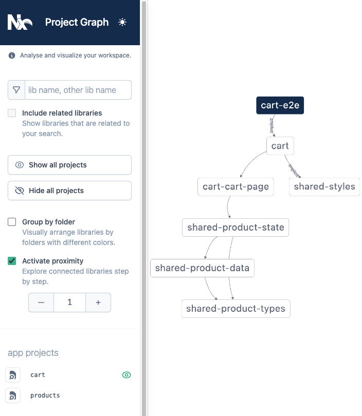

# Explore the Graph

For Nx to run tasks quickly and correctly, it creates a graph of the dependencies between all the projects in the repository. Exploring this graph visually can be useful to understand why Nx is behaving in a certain way and to get a high level view of your code architecture.

To launch the project graph visualization run:

```bash
nx graph
```

This will open a browser window with an interactive representation of the project graph of your current codebase. Viewing the entire graph can be unmanageable even for smaller repositories, so there are several ways to narrow the focus of the visualization down to the most useful part of the graph at the moment.

1. Focus on a specific project and then use the proximity and group by folder controls to modify the graph around that project.
2. Use the search bar to find all projects with names that contain a certain string.
3. Manually hide or show projects in the sidebar

Once the graph is displayed, you can click on an individual dependency link to find out what specific file(s) created that dependency.



## Related Documentation:

### Concepts

- [How the Project Graph is Built](/more-concepts/how-project-graph-is-built)

### Recipes

- [Export Project Graph to JSON](/recipe/export-project-graph)
- [Resolve Circular Dependencies](/recipe/resolve-circular-dependencies)

### Reference

- [Graph Command](/nx/dep-graph)
