# Plugin Isolation Architecture

## 1. Plugin Loading Flow

### 1a. Entry Point - Isolation Decision

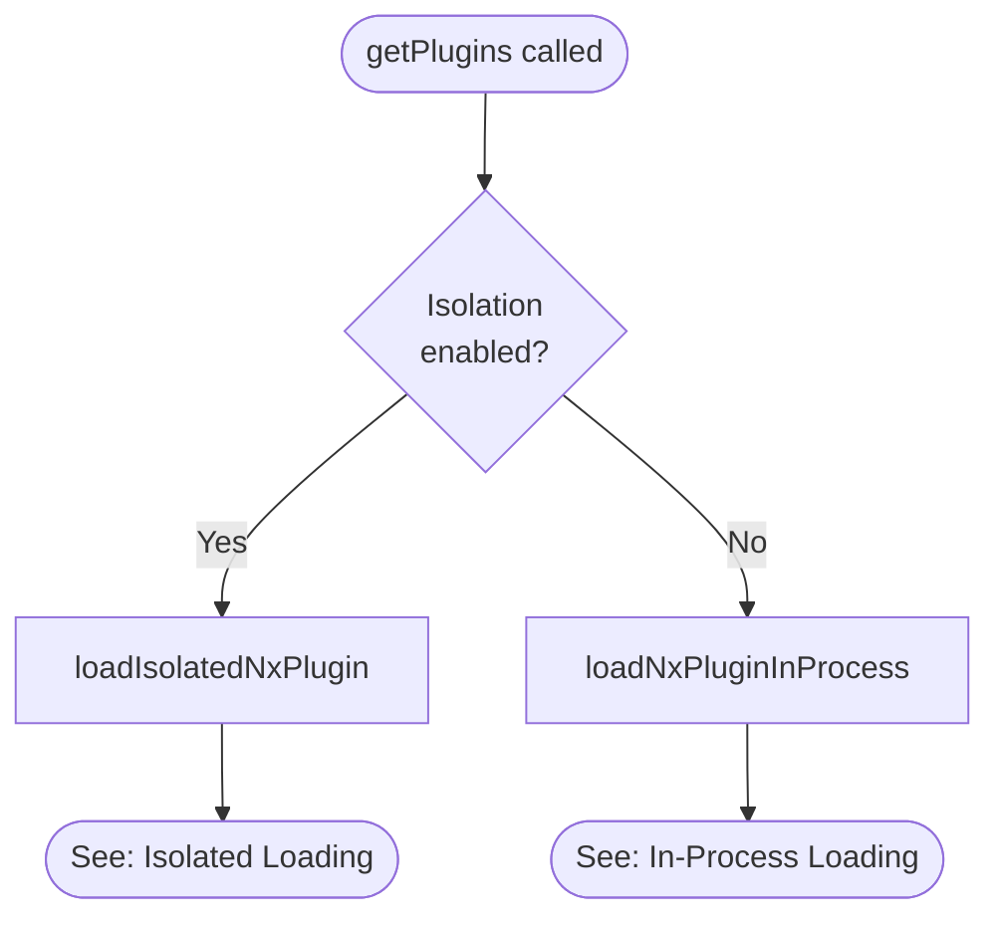

### 1b. Isolated Plugin Loading

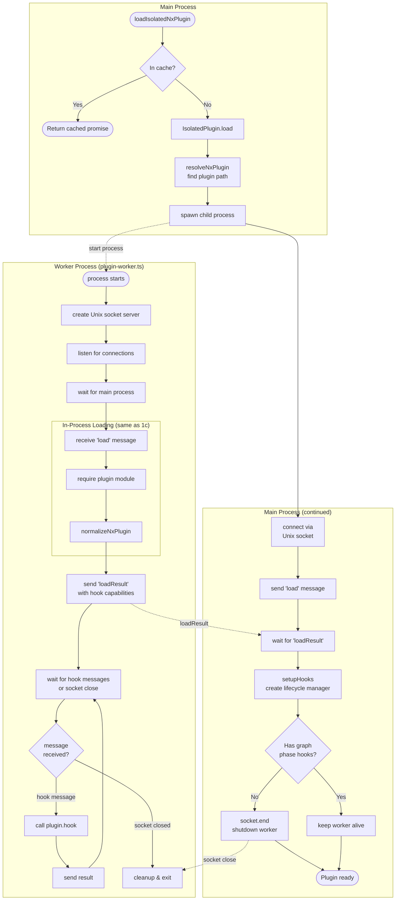

### 1c. In-Process Plugin Loading

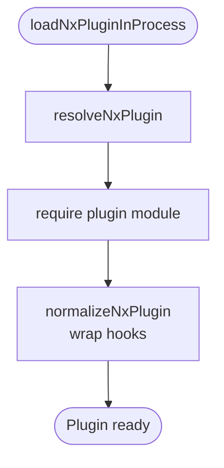

## 2. Hook Execution Flow

### 2a. Isolated Hook Execution

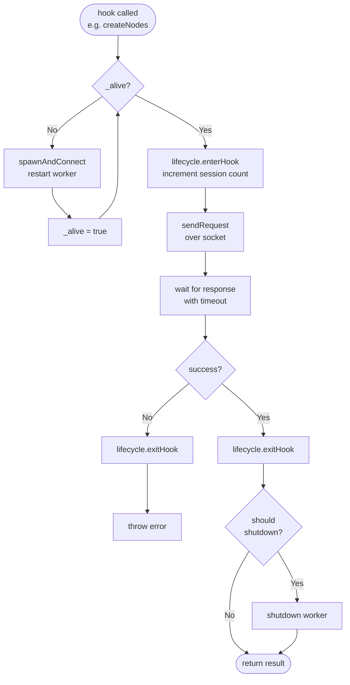

### 2b. Shutdown Decision Logic

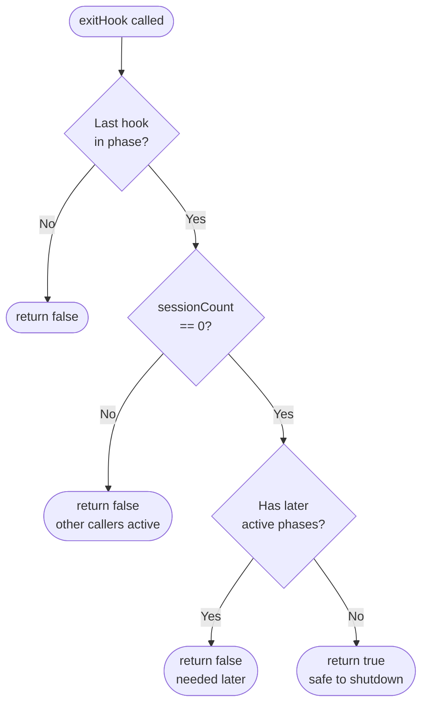

## 3. Developer Workflow: Adding/Modifying Plugin Hooks

### Step 1: Design Public API

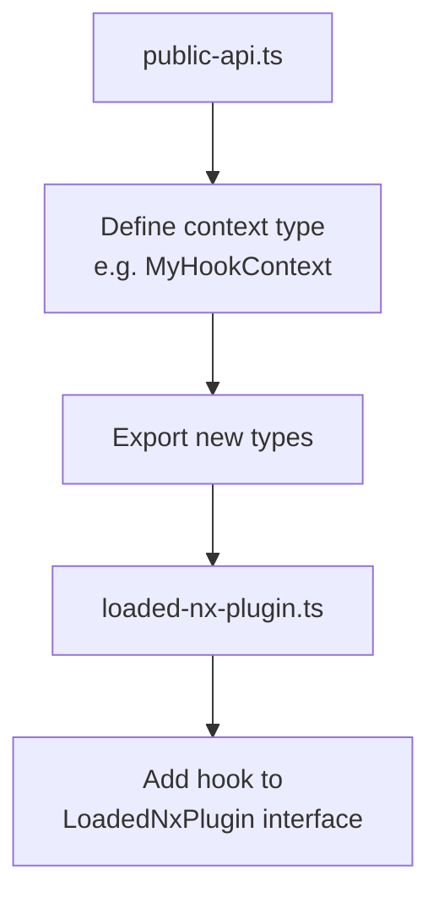

### Step 2: Define Message Types

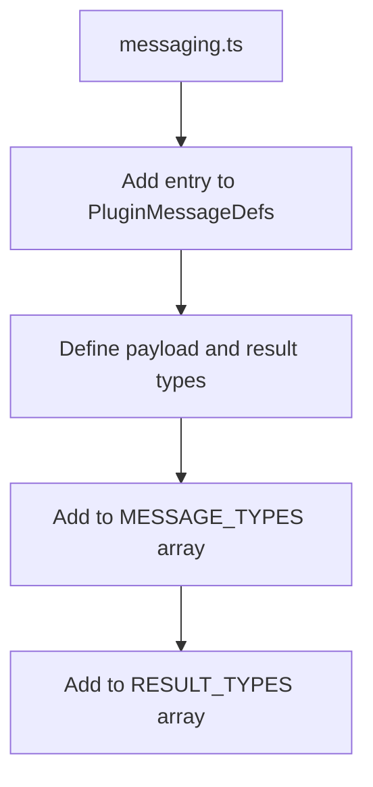

The messaging system uses a unified `DefineMessages` pattern. To add a new message:

```typescript
// In PluginMessageDefs, add a new entry:
type PluginMessageDefs = DefineMessages<{
  // ... existing messages ...

  myHook: {
    payload: {
      context: MyHookContext;
    };
    result:
      | { success: true; data: MyResultData }
      | { success: false; error: Error };
  };
}>;
```

The individual message/result types (`PluginWorkerMyHookMessage`, `PluginWorkerMyHookResult`)
are automatically derived. Export them if needed for external use:

```typescript
export type PluginWorkerMyHookMessage = MessageOf<PluginMessageDefs, 'myHook'>;
export type PluginWorkerMyHookResult = ResultOf<PluginMessageDefs, 'myHook'>;
```

### Step 3: Handle in Worker Process

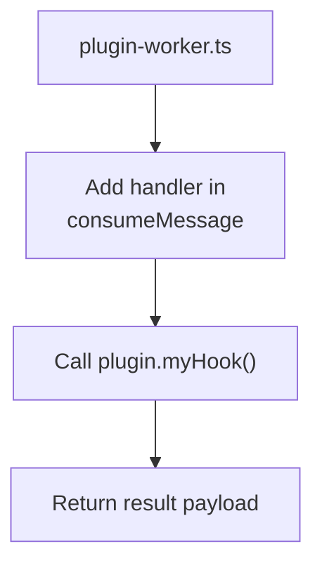

Handlers return just the result payload - the infrastructure wraps it automatically:

```typescript
// In consumeMessage handlers:
myHook: async ({ context }) => {
  try {
    const data = await plugin.myHook(context);
    return { success: true as const, data };
  } catch (e) {
    return { success: false as const, error: createSerializableError(e) };
  }
},
```

### Step 4: Update Load Result

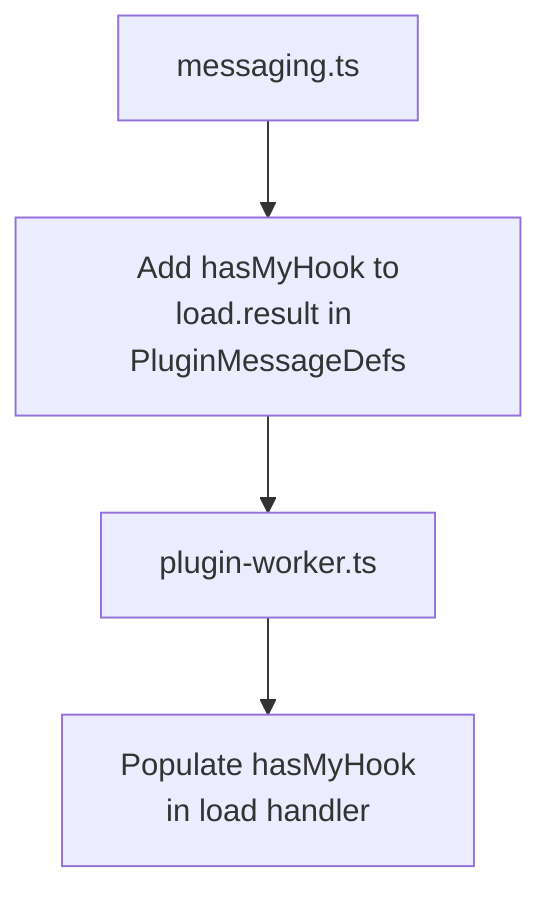

### Step 5: Wire Up IsolatedPlugin

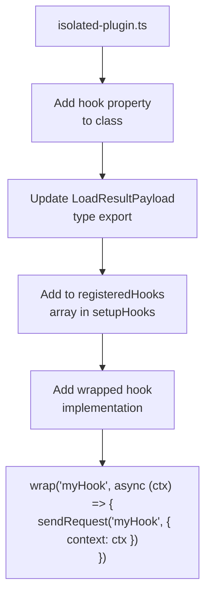

### Step 6: Update Lifecycle Phases (if needed)

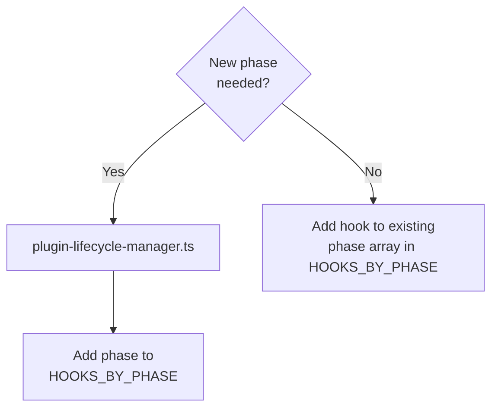

### Step 7: Add Tests

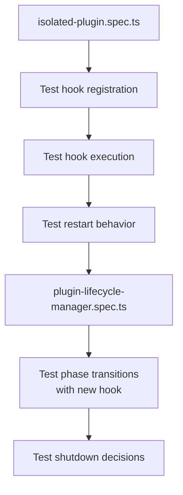

## File Reference

| File                          | Purpose                                                       |
| ----------------------------- | ------------------------------------------------------------- |
| `../public-api.ts`            | Public types exported to plugin authors                       |
| `../loaded-nx-plugin.ts`      | Interface definition for loaded plugins                       |
| `messaging.ts`                | Message type definitions for worker communication             |
| `plugin-worker.ts`            | Worker process - receives messages, calls plugin functions    |
| `isolated-plugin.ts`          | Main class - spawns worker, sends messages, manages lifecycle |
| `plugin-lifecycle-manager.ts` | Tracks phases, decides when to shutdown                       |
| `load-isolated-plugin.ts`     | Caching layer for isolated plugins                            |
| `../get-plugins.ts`           | Entry point - decides isolation mode                          |

## Lifecycle Phases

```
LOADED → [graph] → [pre-task] → {tasks run} → [post-task]
           │           │                           │
           │           └── preTasksExecution ──────┤
           │                                       │
           ├── createNodes                         │
           ├── createDependencies                  │
           └── createMetadata                      │
                                                   │
                                    postTasksExecution
```

**Shutdown rules:**

- Plugin shuts down after its last active phase completes
- If only `postTasksExecution`: shutdown immediately after load, restart when needed
- Concurrent callers tracked via session count (ref counting)
